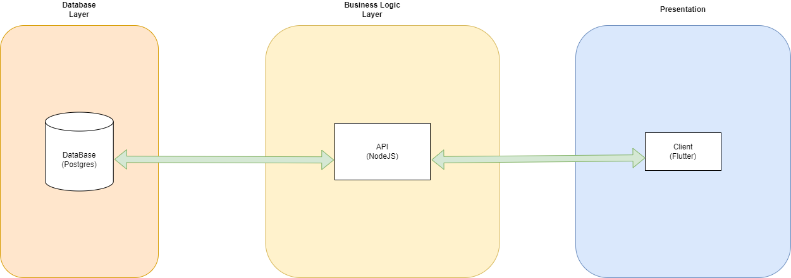

# Team AMMA.exe

## Phase One Video

      <a href="https://drive.google.com/file/d/1qrzOrLa2lYwb130EcHiFBMrbswX2yQP0/view?usp=sharing">Phase One Video here</a>

Thank you mnr!!!

  AMMA.exe is a dynamic, enthusiastic and talented team. We leverage our unique individual strengths to bring out the best in our team. With skills Ranging from devops, frontend, backend, our team delievers the best solution for your       
  problem

## Team Members

  

#### Agape Mamphasa

#### Role(s): Database Engineer, DevOps Engineer, Backend Engineer

#### 3rd Year Computer Science Student at The University Of Pretoria

#### Favourite Language(s): Java, JavaScript, php

 
 
 
 

  

#### Monica Brancon

#### Role(s): Lead Frontend designer

#### 2nd Year Computer Science Student at The University Of Pretoria

#### Favourite Language(s): Java

 
 

  

#### Amanda Khuzwayo

#### Role(s): Backend Engineer, Frontend Engineer, Database Engineer

#### 3rd Year Computer Science Student at The University Of Pretoria

#### Favourite Language(s): Java, C++

 
 

  

#### Mbofho Mamatsharaga

#### Role(s): Frontend Engineer

#### 3rd Year Computer Science Student at The University Of Pretoria

#### Favourite Language(s): Java, dart

 

## Tech Stack

  Our Technology stack is very diverse and unique. We didn't go the full Javascript/typescript stereotypical stack. We mixed and matched different technologies. This was due to our diverse skills and knowledge of different technologies.
  How we intergrated all of these elements together was an interesting challenge to say the least.

### Frontend: Flutter

  Flutter is a very good framework that isn't restricted by any operating system or platfor. Whether you are on android, the web or IOS, flutter is the best framework for the job. Build one app, and simply port it across all the 
  platforms.

### Backend: Nodejs

  Nodejs is essentially serverside javascript. Our familiarity with JavaScript made working with the backend a fairly straight forward task. Javascript just works, and that's why our backend engineers chose it. Beside it
  being user-friendly, javaScript is very fast, and making API endpoints with it is super simple.

### Database: Postgres

  Postgres is an Object Relational database management system. It's what happens when you intergrate object oriented features with a traditional relational database. Postgres is also compitable with many backend frameworks like
  node. So that was also a factor why we chose it.

## Git Strategy

  For our version control and project management, we used git-flow. Essentially, we have 3 main branches:

-   **main**: This is where the latest and stable version of our code will lie. Only the devOps engineer may push to main.
-   **develop**: This is the development playground. A lot of things are built, tested and broken on this branch. This ensures that bad code doesn't make it to main.
-   **feature**: This is where developers work on different features of the app e.g the login page. The final page is then merged into develop.

**Here is a nice neat diagram to illustrate how git-flow works:**
 
 

## Architecture

  For our system, we used a simple n-tier architecture. The 3 main tiers were:

 
-   **Database Layer**: This is where our database resides. We used Postgres for our database implementation. We use PGAdmin for our database visualiser and query tool.
-   **Business Logic Layer**: This is where the backend resides. The backend is essentially a set of functions that communicate with the database, and the client uses URL endpoints to connect with the backend. 
-   **Presentation Layer**: We used flutter for the presentation layer. We chose flutter because of it's compatibility with many operating systems.

  **Below is a picture of our Architectural diagram:**
  
   

 

## Database Model

  We modelled our database using UML diagrams. This fits into the theme of using postgres. It's an Object Relational Database Management System. Using UML models correctly fits that narrative of Object Orientation

  **Below is a picture of our Database Model:**
  
   

## How to Run

### Backend

- Download nodejs v18 or higher
- cd into the backend folder
- run npm install (to install all the packages)
- go into the terminal
- run node database.js (to run the db)
- run node populate.js (to populate the db with mock data)
- run node main.js (to run the backend)
- [http:localhost:3000](http://localhost:3000/) will be the main url endpoint

### Frontend

- If you do not have the Flutter SDK installed already, install it as follows, if you do have it installed, skip:
  - Download the latest stable version of the Flutter SDK on [The Flutter site](https://docs.flutter.dev/get-started/install)
  - Follow the instruction for installation on your operating system.
  - Test if installation was successful by running the command "flutter doctor" in your command prompt or powershell.
  - If all is successful, you can skip the next instruction.
  - If it is not successful, resolve (consult the Flutter site and GitHub Repo issues for possible resolutions).
- clone our main branch on our Repo.
- Open the project in any IDE of your choice, preferrably Visual Studio Code.
- change device to any emulator of a mobile device available ( We used the Google Pixel 3a emulator)
- wait for device emulator to boot up
- Once booted, navigate to the 'main.dart' file.
- in the main.dart file, at the top right of the screen, click on the drop-down next to the play button.
- click on "start debugging".
- the app will be running on the emulator.

## Other Documents

  Below is a set of documents we used in the implementation process. This includes our coding standards, api documentation and brain storming documentation we used to 
  come up with te initial concept and design.

      <a href="https://docs.google.com/document/d/1Q_UGGy3Zy7aTKsgCVdtZIqQkih8GgJ4NibeXF9X5ShY/view?usp=sharing">Coding Standards</a>
         
      <a href="https://docs.google.com/document/d/1uDweZnDODpkeqNZ519_F3i5KZRffJw9s2gxqEbJY9yU/view?usp=sharing">Brain Storm</a>
         
      <a href="https://docs.google.com/document/d/14FxS9RjSJ_9CiGTXnoT7CUYo_Y14H0Pw8A7o_hApow4/view?usp=drive_link">api Doc</a>
         
      <a href="https://www.figma.com/file/PaALFcqUjmLU1Kjz33sVAP/HEALTHI-io?type=design&node-id=1%3A2&mode=design&t=9q9WTcecWPQzA3QV-1">High Fidelity Prototypes</a>
  
    

